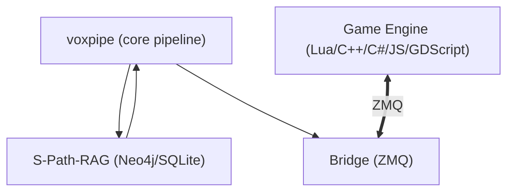

# GameASR — Voice-Controlled Game Agent

[](LICENSE)
[]()
[](https://github.com/shervinemp/GameASR/actions/workflows/ci.yml)

Voice-controlled game agent with S-Path-RAG. Built on [voxpipe](https://github.com/shervinemp/voxpipe) — speech capture, LLM tool calling, and streaming TTS come from the modular pipeline; GameASR adds graph-based knowledge retrieval, game engine bridge clients, and active learning.



## Features

- **ASR** — Speech-to-text (ParakeetV2) with push-to-talk and VAD barge-in via voxpipe
- **LLM** — Local GGUF or LiteLLM remote backends (Ollama, OpenAI, Gemini) via voxpipe
- **TTS** — Kokoro voice feedback with interrupt-on-speech via voxpipe
- **S-Path-RAG** — Knowledge graph retrieval over Neo4j with entity linking, adaptive expansion, Socratic correction loop
- **Bridge** — ZMQ/TCP/IPC bridge to game engines (Lua, C++, C#, JS, GDScript, Python)
- **Active learning** — Optional triplet extraction with review queue before graph ingestion
- **Push-to-talk** — Configurable hotkey; speaking cuts off current TTS

## Quick Start

```bash
# 1. Install dependencies (installs voxpipe from git)
uv sync

# 2. Configure
cp config.example.yaml config.yaml
cp .env.example .env

# 3. Edit .env with your secrets

# 4. Import knowledge graph data (optional)
uv run python -m voice_control.rag.data

# 5. Run pipeline with tool specs
uv run voice-control api_spec.json
```

## Architecture

| Layer | Project | What it provides |
|-------|---------|-----------------|
| **Core pipeline** | [voxpipe](https://github.com/shervinemp/voxpipe) | ASR, LLM (session/conversation/tools), streaming TTS, config, event system, hotkeys, memory |
| **Game layer** | GameASR | S-Path-RAG, Neo4j/SQLite backends, game bridge (ZMQ RPC), active learning, per-language clients |

## Configuration

```yaml
llm:
  backend: "local"           # "local" (GGUF) or "litellm" (remote)
  model: "Gemma4_12B"        # key into llm.local
  local:
    Gemma4_12B:
      n_ctx: 8192
      decoder: "legacy_xml"

rag:
  runtime:
    backend: "neo4j"         # "neo4j" or "sqlite"
    top_k: 5
  conversation:
    max_turns: 20
  conversation_history:
    enabled: true
    threshold: 0.75
```

## Environment variables

```bash
NEO4J_PASSWORD="password"
OPENAI_API_KEY="sk-..."
```

Non-loopback RPC bind requires `RPC_AUTH_TOKEN` (≥32 chars). Put any remotely accessible TCP bridge behind a VPN or TLS.

## Project Structure

```
voice_control/
├── rag/                  # S-Path-RAG (Neo4j/SQLite, retrieval, generation, active learning)
├── bridge/               # Game engine bridge (ZMQ RPC server, per-language clients)
├── common/               # GameASR-specific config models + model manifest
├── pipeline.py           # Orchestrator (wires voxpipe + RAG + bridge)
└── __main__.py           # CLI entry point
```

Core pipeline modules (ASR, TTS, LLM, streaming, events, hotkeys, memory) come from [voxpipe](https://github.com/shervinemp/voxpipe).

## RAG Pipeline

S-Path-RAG: entity linking → dual retrieval (vector + fulltext) → graph strategies (neighborhood, shortest path) → web fallback → reranking → evidence delivery → Socratic correction loop. See [RAG docs](https://github.com/shervinemp/GameASR/wiki/RAG) for details.

## Bridge Clients

| Language | Path |
|----------|------|
| Lua | `lua_client_example/voice_client.lua` |
| C++ | `voice_control/bridge/clients/cpp/` |
| C# | `voice_control/bridge/clients/cs/` |
| JavaScript | `voice_control/bridge/clients/js/` |
| GDScript | `voice_control/bridge/clients/gdscript/` |
| Python | `voice_control/bridge/clients/python/` |

## Testing

```bash
pytest tests/
```

## License

MIT
