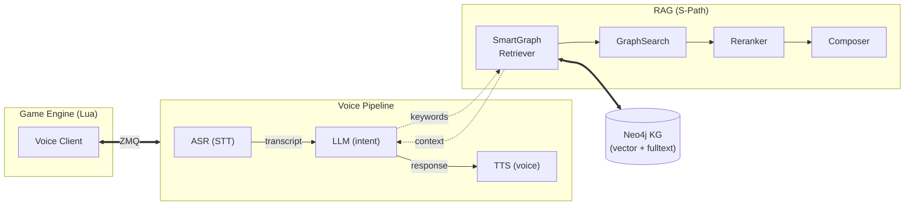

# GameASR — Voice-Controlled Game Agent

A modular voice control pipeline with graph-based RAG. ASR captures speech, LLM parses intent, TTS responds, and a Neo4j knowledge graph enriches answers with structured facts via S-Path-RAG.

## Architecture



## Features

- **ASR** — Speech-to-text (ParakeetV2, configurable) with push-to-talk
- **LLM** — Intent parsing + response generation (Ollama, OpenAI, Gemini, GGUF)
- **TTS** — Voice feedback (Kokoro) with interrupt on new input
- **RAG** — S-Path-RAG over Neo4j with entity linking, anchor dedup, adaptive expansion, and Socratic correction loop
- **Bridge** — ZMQ/TCP/IPC bridge to game engines (Lua, C++, C#, JS, GDScript, Python)
- **Push-to-talk** — Configurable hotkey binding; speaking cuts off current TTS
- **Active learning** — Extracts new triplets from answers and persists them back to the knowledge graph

## Prerequisites

- Python 3.8+
- [uv](https://docs.astral.sh/uv/) (package manager)
- Neo4j 2025+ — for knowledge graph RAG
- [eSpeak NG](https://github.com/espeak-ng/espeak-ng) — for TTS phonemization (install to default path `C:\Program Files\eSpeak NG`)
- (Optional) Ollama, OpenAI key, or Gemini key for LLM backend

## Quick Start

```bash
# 1. Install dependencies
uv sync

# 2. Configure
cp voice_control/config.defaults.yaml config.yaml

# 3. Set required environment variables
export NEO4J_PASSWORD="your_neo4j_password"
# LLM (pick one):
export OPENAI_API_KEY="sk-..."
# or
export GEMINI_API_KEY="..."
# (Ollama needs no key — just ensure the service is running)

# 4. Import knowledge graph data (optional)
uv run python -m voice_control.rag.data

# 5. Run (bridge server with web-search RAG):
uv run python -m voice_control api_spec.json

# Or run (interactive pipeline):
uv run python -m voice_control.pipeline
```

## Configuration

All defaults in `voice_control/config.defaults.yaml`. Override by creating `config.yaml` at the project root:

```yaml
llm:
  provider: "Gemma4E2B"          # openai | gemini | ollama | Gemma4E2B
  providers:
    ollama:
      model: "qwen3:latest"
    openai:
      model: "gpt-4o"

database:
  neo4j:
    uri: "bolt://localhost:7687"
    user: "neo4j"
    # Password from NEO4J_PASSWORD env var
```

Secrets in `.env` file:

```bash
NEO4J_PASSWORD="password"
OPENAI_API_KEY="sk-..."
GEMINI_API_KEY="..."
```

## RAG Pipeline

The project implements **S-Path-RAG** (Semantic Shortest-Path Retrieval-Augmented Generation):

### Pipeline flow

1. **Entity linking** — Fast exact-label lookup (`MATCH WHERE toLower(n.label) = label`) before any embedding. Known entities are resolved instantly at zero vector cost.
2. **Dual retrieval** — Vector search (embeddings) + keyword search (fulltext index) run in parallel against Neo4j.
3. **Strategy execution**:
   - **NeighborhoodStrategy**: N-hop semantic expansion around matched entities. Auto-retries with `n_hops=2` when `n_hops=1` returns < 3 results.
   - **ShortestPathStrategy**: Finds multi-hop paths between anchor entities. Anchors are deduplicated by label before combinatorial pairing. All pairs are batched into a single Cypher UNWIND query (was N separate round-trips per pair).
4. **Reranking** — Cross-encoder scores and re-orders top-20 results.
5. **Socratic loop** — Generates a draft answer, critiques it against the original context (not the lossy summary), and re-retrieves if uncertain. Skipped entirely when the first pass returns high-confidence graph results.
6. **Composition** — Final answer generated from accumulated context. LLM summarization is skipped when context is already clean graph output.
7. **Active learning** — New triplets extracted from answers are persisted to Neo4j with `source: 'extraction'` and `created_at` timestamp.
8. **Fallback** — DuckDuckGo Instant Answer API → DDGS library → Lite HTML endpoint.

### Optimizations

| Technique | Impact |
|-----------|--------|
| Exact-label entity linking | Catches known entities before any embedding (zero vector cost) |
| Parallel vector + keyword search | Both searches run concurrently |
| Anchor dedup by label | Prevents 55+ useless k_shortest_paths queries from aliased anchors |
| Batch SPath queries | All anchor pairs in one Cypher UNWIND instead of N round-trips |
| Truncate before reranker (top 20) | Avoids scoring hundreds of low-value results |
| Adaptive expansion (n_hops 1→2) | Auto-retries broader search when initial results are thin |
| Skip LLM summarization for graph output | Saves 1–3s when context is already structured sentences |
| Skip Socratic loop on high confidence | First-pass graph results skip the critique loop entirely |
| Web search fallback chain | DDG Instant Answer → DDGS → Lite HTML (three layers of fallback) |

### Key modules

| Module | Purpose |
|--------|---------|
| `rag/retrieval.py` | Reranker, graph strategies, SmartGraphRetriever, WebRetriever with fallback chain |
| `rag/knowledge.py` | Neo4j driver (vector search, keyword search, batch SPath, expansion, exact-label lookup) |
| `rag/model.py` | BaseRAG, SimpleRAG, SPathRAG orchestrators with active learning |
| `rag/generation.py` | Composer with Socratic correction, SLM-optimized prompts |
| `rag/triplet.py` | LLM-based knowledge triplet extraction |
| `rag/data.py` | CoDEx dataset import, entity/relationship import with source tracking |

### Knowledge Graph

All nodes and relationships carry `source` (`'import'` or `'extraction'`) and `created_at` for temporal queries:

```cypher
// All extracted (learned) knowledge
MATCH (n:Entity {source: 'extraction'})
// Relationships added after a specific time
MATCH ()-[r {source: 'extraction'}]->()
```

Import a CoDEx-formatted dataset:

```bash
uv run python -m voice_control.rag.data
```

## Bridge Clients

| Language | Path |
|----------|------|
| Lua | `lua_client_example/voice_client.lua` |
| C++ | `voice_control/bridge/clients/cpp/` |
| C# | `voice_control/bridge/clients/cs/` |
| JavaScript | `voice_control/bridge/clients/js/` |
| Python | `voice_control/bridge/clients/python/` |
| GDScript | `voice_control/bridge/clients/gdscript/` |

The bridge uses ZeroMQ (TCP or IPC). Game clients connect to the pipeline's RPC server and expose functions via `rpc_api.lua`.

## Push-to-Talk

- **Default hotkey**: <kbd>Right Ctrl</kbd>+<kbd>Right Shift</kbd>
- **Press and hold** to speak, **release** when done
- **Speaking while TTS is playing** interrupts the current output immediately
- **Press-to-reset**: <kbd>Left Ctrl</kbd>+<kbd>Right Ctrl</kbd> clears conversation history

## Project Structure

```
voice_control/
├── asr/                  # Speech-to-text providers
├── tts/                  # Text-to-speech (Kokoro)
├── llm/                  # Language model layer (session, conversation, tools)
├── rag/                  # Retrieval-augmented generation (S-Path-RAG)
├── bridge/               # Game engine bridge (ZMQ clients, RPC server)
├── pipeline.py           # Main orchestration pipeline
├── config.defaults.yaml  # Default configuration
└── __main__.py           # CLI entry point
```

## Testing

```bash
uv run python -m unittest discover -s tests -v
```

## License

MIT
