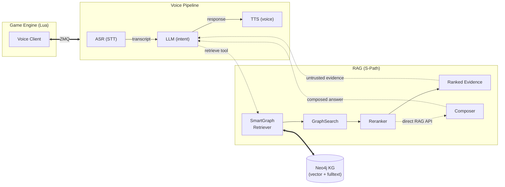

# GameASR — Voice-Controlled Game Agent

A modular voice control pipeline with graph-based RAG. ASR captures speech, LLM parses intent, TTS responds, and a Neo4j knowledge graph enriches answers with structured facts via S-Path-RAG.

## Architecture



## Features

- **ASR** — Speech-to-text (ParakeetV2, configurable) with push-to-talk
- **LLM** — Unified LiteLLM access for Ollama/OpenAI/Gemini plus direct local GGUF inference
- **TTS** — Voice feedback (Kokoro) with interrupt on new input
- **RAG** — S-Path-RAG over Neo4j with entity linking, anchor dedup, adaptive expansion, and Socratic correction loop
- **Bridge** — ZMQ/TCP/IPC bridge to game engines (Lua, C++, C#, JS, GDScript, Python)
- **Push-to-talk** — Configurable hotkey binding; speaking cuts off current TTS
- **Reviewable learning** — Optionally extracts new triplets into a local review queue before graph ingestion

## Prerequisites

- Python 3.11-3.13
- [uv](https://docs.astral.sh/uv/) (package manager)
- Neo4j 2025+ — for knowledge graph RAG
- [eSpeak NG](https://github.com/espeak-ng/espeak-ng) — for TTS phonemization (install to default path `C:\Program Files\eSpeak NG`)
- (Optional) Ollama, OpenAI key, or Gemini key for LLM backend

## Quick Start

```bash
# 1. Install dependencies
uv sync

# 2. Configure
cp voice_control/config.defaults.yaml config.yaml

# 3. Set required environment variables
export NEO4J_PASSWORD="your_neo4j_password"
# LLM (pick one):
export OPENAI_API_KEY="sk-..."
# or
export GEMINI_API_KEY="..."
# (Ollama needs no key — just ensure the service is running)

# Required only when deliberately binding RPC to a non-loopback interface:
export RPC_AUTH_TOKEN="a-random-secret-with-at-least-32-characters"
export TOOLS_AUTH_TOKEN="a-second-secret-with-at-least-32-characters"

# 4. Import knowledge graph data (optional)
uv run python -m voice_control.rag.data

# 5. Run (bridge server with web-search RAG):
uv run python -m voice_control api_spec.json

# Or run (interactive pipeline):
uv run python -m voice_control.pipeline
```

## Configuration

All defaults in `voice_control/config.defaults.yaml`. Override by creating `config.yaml` at the project root:

```yaml
llm:
  provider: "Gemma4E2B"          # openai | gemini | ollama | LiteLLM | Gemma4E2B
  providers:
    ollama:
      model: "qwen3:latest"
      host: "http://localhost:11434"
    openai:
      model: "gpt-4o"

database:
  neo4j:
    uri: "bolt://localhost:7687"
    user: "neo4j"
    database: "neo4j"
    query_timeout_seconds: 5
    # Password from NEO4J_PASSWORD env var

rpc_server:
  env:
    auth_token: "RPC_AUTH_TOKEN"  # environment variable name
  max_request_bytes: 65536
  requests_per_minute: 60

rag:
  runtime:
    top_k: 5
    reranker_input_limit: 20
    max_direct_context_tokens: 2048
    retrieval_deadline_seconds: 8
    web_timeout_seconds: 4
    cache_ttl_seconds: 300
    cache_size: 128
    max_iterations: 3
  active_learning:
    enabled: false
    allow_web_context: false
    review_required: true
    review_queue_path: "data/pending_triplets.jsonl"
```

RPC binds to `127.0.0.1` by default. A non-loopback `--host` is rejected unless
`RPC_AUTH_TOKEN` is set to a secret of at least 32 characters. Put any remotely
accessible TCP bridge behind an encrypted transport such as a VPN or TLS tunnel.

Secrets in `.env` file:

```bash
NEO4J_PASSWORD="password"
OPENAI_API_KEY="sk-..."
GEMINI_API_KEY="..."
```

## RAG Pipeline

The project implements **S-Path-RAG** (Semantic Shortest-Path Retrieval-Augmented Generation):

### Pipeline flow

1. **Entity linking** — Bounded query n-grams are matched through the indexed `normalized_label` property before NER or LLM extraction. Lowercase ASR transcripts still resolve known entities without a model call.
2. **Dual retrieval** — Unresolved entities use vector search while keyword search uses the fulltext index. Neighborhood vector and keyword searches run in parallel.
3. **Strategy execution**:
   - **NeighborhoodStrategy**: N-hop semantic expansion around matched entities. Auto-retries with `n_hops=2` when `n_hops=1` returns < 3 results.
   - **ShortestPathStrategy**: Pairs candidates only across distinct query entities, caps pair count, and uses Neo4j's native bounded `SHORTEST k` selector in one parameterized query.
4. **Source routing** — The game graph is queried first. Web search runs only when the graph returns no evidence and must finish inside the shared retrieval deadline.
5. **Reranking** — Candidates are bounded and deduplicated before the cross-encoder; identical reranking work and final contexts are cached under synchronized LRU caches.
6. **Evidence delivery** — The conversation's `retrieve` tool returns ranked `[graph]` or `[web]` evidence. The outer assistant performs the only user-facing synthesis, avoiding answer-to-answer generation.
7. **Direct composition** — Direct `rag(query)` calls remain supported. Internal prompts are stateless, short context bypasses lossy summarization, and a draft that passes critique is returned without regeneration.
8. **Reviewable learning** — Disabled by default. Approved learned nodes receive normalized labels and embeddings; cache entries are invalidated after graph writes.

### Optimizations

| Technique | Impact |
|-----------|--------|
| Indexed normalized-label linking | Catches known entities before NER, LLM extraction, or embedding |
| Parallel vector + keyword search | Both searches run concurrently |
| Cross-entity anchor pairing | Avoids paths between alternative matches for the same query entity |
| Native bounded shortest paths | Avoids enumerating and sorting every path up to three hops |
| Dedupe before reranker | Avoids scoring duplicate candidates while preserving coverage |
| Adaptive expansion (n_hops 1→2) | Auto-retries broader search when initial results are thin |
| Stateless one-shot internal prompts | Prevents hidden RAG history growth and cross-request contamination |
| Budget-aware summarization | Short evidence reaches generation unchanged and without an extra call |
| Graph-first web fallback | Removes network latency and untrusted web noise for graph-covered queries |
| Deadline and synchronized LRU caches | Bounds tail latency and skips repeated retrieval/reranking work |

After upgrading an existing graph, rerun `uv run python -m voice_control.rag.data`
to add the normalized-label index and rebuild entity embeddings from labels plus
descriptions. Runtime lookup retains a slower legacy fallback until migration.

### Key modules

| Module | Purpose |
|--------|---------|
| `rag/retrieval.py` | Reranker, graph strategies, SmartGraphRetriever, WebRetriever with fallback chain |
| `rag/knowledge.py` | Neo4j driver (vector search, keyword search, batch SPath, expansion, exact-label lookup) |
| `rag/model.py` | BaseRAG, SimpleRAG, SPathRAG orchestrators with active learning |
| `rag/generation.py` | Composer with Socratic correction, SLM-optimized prompts |
| `rag/triplet.py` | LLM-based knowledge triplet extraction |
| `rag/data.py` | CoDEx dataset import, entity/relationship import with source tracking |

### Knowledge Graph

Imported nodes and relationships carry provenance metadata. Approved learned
triplets can use `source: 'extraction'` and `created_at` for temporal queries:

```cypher
// All extracted (learned) knowledge
MATCH (n:Entity {source: 'extraction'})
// Relationships added after a specific time
MATCH ()-[r {source: 'extraction'}]->()
```

Import a CoDEx-formatted dataset:

```bash
uv run python -m voice_control.rag.data
```

## Bridge Clients

| Language | Path |
|----------|------|
| Lua | `lua_client_example/voice_client.lua` |
| C++ | `voice_control/bridge/clients/cpp/` |
| C# | `voice_control/bridge/clients/cs/` |
| JavaScript | `voice_control/bridge/clients/js/` |
| Python | `voice_control/bridge/clients/python/` |
| GDScript | `voice_control/bridge/clients/gdscript/` |

The bridge uses ZeroMQ (TCP or IPC). Game clients connect to the pipeline's RPC server and expose functions via `rpc_api.lua`. Public/wildcard binds require authentication; loopback is the secure default.

Bundled GGUF and TTS assets are downloaded only from allowlisted HTTPS origins,
at pinned revisions where applicable, and verified against committed SHA-256
digests before loading.

### LLM provider routing

`openai`, `gemini`, and `ollama` use the in-process LiteLLM SDK and share the
same streaming, tool-call, timeout, and error-handling path. The `LiteLLM`
provider can also be selected directly with an explicit `provider` and `model`.
No LiteLLM proxy process is started by this project.

Provider requests have a bounded timeout and automatic retries are disabled for
streaming calls, avoiding duplicate tool effects after a partial response. API
keys are resolved from environment variables and the project does not enable
LiteLLM debug logging, callbacks, or telemetry hooks. The bundled model-cost map
is used offline by default; set `LITELLM_LOCAL_MODEL_COST_MAP=False` before
startup to opt into LiteLLM's online cost-map refresh.

Embedded `Gemma4E2B`, `Gemma4_12B`, `Qwen3`, and `NemotronMini` providers keep
using `llama-cpp-python` directly so their local model state and custom stream
decoders remain available. Custom remote `api_base` URLs must use HTTPS;
plaintext HTTP is accepted only for loopback services such as local Ollama.

## Push-to-Talk

- **Default hotkey**: <kbd>Right Ctrl</kbd>+<kbd>Right Shift</kbd>
- **Press and hold** to speak, **release** when done
- **Speaking while TTS is playing** interrupts the current output immediately
- **Press-to-reset**: <kbd>Left Ctrl</kbd>+<kbd>Right Ctrl</kbd> clears conversation history

## Project Structure

```
voice_control/
├── asr/                  # Speech-to-text providers
├── tts/                  # Text-to-speech (Kokoro)
├── llm/                  # Language model layer (session, conversation, tools)
├── rag/                  # Retrieval-augmented generation (S-Path-RAG)
├── bridge/               # Game engine bridge (ZMQ clients, RPC server)
├── pipeline.py           # Main orchestration pipeline
├── config.defaults.yaml  # Default configuration
└── __main__.py           # CLI entry point
```

## Testing

```bash
uv run python -m unittest discover -s tests -v
```

## License

MIT
