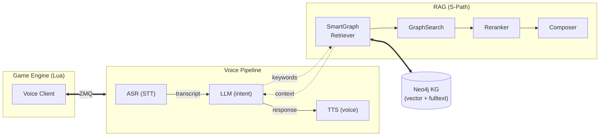

# GameASR — Voice-Controlled Game Agent

A modular voice control pipeline that lets you control games and applications using natural speech. Features ASR (speech-to-text), LLM (intent parsing), TTS (voice feedback), and graph-based RAG with iterative Socratic refinement — all with push-to-talk and real-time game-state integration.

## Architecture



## Features

- **ASR** — Speech-to-text (ParakeetV2, Whisper, configurable)
- **LLM** — Intent parsing + response generation (Ollama, OpenAI, Gemini, GGUF)
- **TTS** — Voice feedback (Kokoro, configurable)
- **RAG** — S-Path-RAG over a Neo4j knowledge graph with iterative Socratic correction
- **Bridge** — ZMQ/TCP/IPC bridge to game engines (Lua, C++, C#, JavaScript, GDScript, Python)
- **Push-to-talk** — Configurable hotkey binding
- **Web search fallback** — DuckDuckGo when the graph yields no results

## Prerequisites

- Python 3.8+
- [uv](https://docs.astral.sh/uv/) (package manager)
- Neo4j 2025+ (with APOC plugin) — for knowledge graph RAG
- (Optional) Ollama, OpenAI key, or Gemini key for LLM backend

## Quick Start

```bash
# 1. Install dependencies
uv sync

# 2. Configure
# Create config.yaml in the project root (overrides config.defaults.yaml):
cp voice_control/config.defaults.yaml config.yaml

# 3. Set required environment variables
# Neo4j:
export NEO4J_PASSWORD="your_neo4j_password"
# LLM (pick one):
export OPENAI_API_KEY="sk-..."
# or
export GEMINI_API_KEY="..."
# (Ollama needs no key — just ensure the service is running)

# 4. Import knowledge graph data (optional)
uv run python -m voice_control.rag.data

# 5. Run (bridge server with web-search RAG):
uv run python -m voice_control api_spec.json

# Or run (interactive pipeline with push-to-talk):
uv run python -m voice_control.pipeline
```

## Configuration

All defaults in `voice_control/config.defaults.yaml`. Override by creating `config.yaml` at the project root:

```yaml
llm:
  provider: "ollama"            # openai | gemini | ollama | Gemma4E2B
  providers:
    ollama:
      model: "qwen3:latest"
    openai:
      model: "gpt-4o"

tts:
  provider: "Kokoro"            # TTS backend

asr:
  provider: "ParakeetV2"        # ASR backend

database:
  neo4j:
    uri: "bolt://localhost:7687"
    user: "neo4j"
    # Password is read from the NEO4J_PASSWORD env var (set in .env or shell)
```

Secrets (API keys, passwords) are loaded from environment variables — create a `.env` file in the project root:

```bash
NEO4J_PASSWORD="password"
OPENAI_API_KEY="sk-..."
GEMINI_API_KEY="..."
```

## RAG Pipeline

The project implements **S-Path-RAG** (Semantic Shortest-Path Retrieval-Augmented Generation):

### How it works

1. **Query parsing** — LLM extracts keywords from the voice query
2. **Dual retrieval** — Vector search (embeddings) + keyword search (fulltext index) against the Neo4j knowledge graph
3. **Strategy execution**:
   - **NeighborhoodStrategy**: N-hop semantic expansion around matched entities
   - **ShortestPathStrategy**: Finds multi-hop paths between multiple anchor entities
4. **Reranking** — Cross-encoder scores and re-orders results
5. **Socratic loop** — Generates a draft answer, critiques it, and re-retrieves if uncertain (up to `max_iterations`)
6. **Composition** — Final answer generated from the accumulated context
7. **Fallback** — Web search via DuckDuckGo when the graph returns nothing

### Knowledge Graph import

Imports a CoDEx-formatted dataset:

```bash
uv run python -m voice_control.rag.data
```

The importer:
- Creates vector (cosine) and fulltext indexes on `:Entity` nodes
- Generates embeddings via SentenceTransformers
- Imports entities and typed relationships into Neo4j

### Key modules

| Module | Purpose |
|--------|---------|
| `rag/retrieval.py` | Reranker, retriever strategies, SmartGraphRetriever, WebRetriever |
| `rag/knowledge.py` | Neo4j driver wrapper (vector search, keyword search, SPath, expansion) |
| `rag/model.py` | BaseRAG, SimpleRAG, SPathRAG orchestrators |
| `rag/generation.py` | Composer (summarize → generate → critique → iterate) |
| `rag/triplet.py` | LLM-based triplet extraction for knowledge graph enrichment |

## Bridge Clients

Pre-built clients for integrating voice control into game engines:

| Language | Path |
|----------|------|
| Lua | `lua_client_example/voice_client.lua` |
| C++ | `voice_control/bridge/clients/cpp/` |
| C# | `voice_control/bridge/clients/cs/` |
| JavaScript | `voice_control/bridge/clients/js/` |
| Python | `voice_control/bridge/clients/python/` |
| GDScript | `voice_control/bridge/clients/gdscript/` |

The bridge uses ZeroMQ (TCP or IPC) — the pipeline starts an RPC server, game clients connect and expose functions via `rpc_api.lua`, and voice commands are dispatched as remote calls.

## Project Structure

```
voice_control/
├── asr/                  # Speech-to-text providers
│   ├── model.py          # ASR provider registry
│   └── models/           # Model wrappers (parakeetv2, etc.)
├── tts/                  # Text-to-speech providers
│   └── model.py          # TTS provider registry
├── llm/                  # Language model layer
│   ├── model.py          # LLM provider registry
│   ├── session.py        # Conversation session management
│   ├── conversation.py   # Message history + state
│   ├── context.py        # Token-aware context pruning
│   ├── tools.py          # Function-calling tool support
│   └── decoders.py       # Output parsing strategies
├── rag/                  # Retrieval-augmented generation
│   ├── retrieval.py      # Reranker, graph strategies, web retriever
│   ├── knowledge.py      # Neo4j knowledge graph driver
│   ├── model.py          # RAG orchestrators (SimpleRAG, SPathRAG)
│   ├── generation.py     # Answer composer with Socratic correction
│   ├── triple.py         # LLM-based knowledge triplet extraction
│   └── data.py           # CoDEx dataset import & Neo4j management
├── bridge/               # Game engine bridge
│   ├── llm_server.py     # ZMQ RPC server
│   ├── tool_client.py    # Tool server client
│   ├── scaffold.py       # Client stub code generation
│   └── clients/          # Per-language client libraries
├── pipeline.py           # Main orchestration pipeline
├── config.defaults.yaml  # Default configuration
└── __main__.py           # CLI entry point
```

## Testing

```bash
uv run python -m unittest discover -s tests -v
```

## License

MIT
